  

  
  
  

 

> `Don't hate me, hate the code.`

Full-stack engineer into **backend, security, and automation**. I build the hard, unglamorous stuff — APIs, scrapers, bots, and ERP systems that don't fall over — and lately I've been building **AI-security tooling** and hacking on hardware (Flipper Zero).

## 🧠 What I build
- 🔧 Backend & APIs in **Python (FastAPI)** and **Rust**
- ⚛️ Frontends in **React + TypeScript**
- 🔐 Security: pentesting, OWASP, hardening, and **AI/LLM security tools**
- 🤖 Automation: scrapers, bots, and data pipelines

### 🧰 Stack

  
  
  
  
  
  
  
  
  
  
  

**Backend** — Python · Rust · FastAPI · Node.js · PHP/Laravel · PostgreSQL · Redis
**Frontend** — React · TypeScript · Tailwind · Vite
**Security** — Burp Suite · OWASP · Cloudflare · pentesting
**Embedded / DevOps** — C (Flipper Zero) · Linux · Docker · Nginx · Git

## 🚀 Featured
- 🐶 **[prompthound](https://github.com/ViperDroid/prompthound)** — static analyzer that hunts insecure AI/LLM code (keys, prompt-injection sinks, LLM output → RCE/XSS/SQLi)
- 🛡️ **[flipper-badge-audit](https://github.com/ViperDroid/flipper-badge-audit)** — NFC access-badge security auditor for Flipper Zero
- 🔥 **Kurd Repack** — torrent scraper & importer platform
- 🕸️ **Website Cloner** — recursive website downloader

## 📊 GitHub

  
  

  

  

## 📫 Reach me
🌐 <a href="https://zakarea-jabbarr.netlify.app">zakarea-jabbarr.netlify.app</a> &nbsp;·&nbsp; 💬 Telegram <a href="https://t.me/i_peu">@i_peu</a>

<!-- SNAKE_PLACEHOLDER -->
